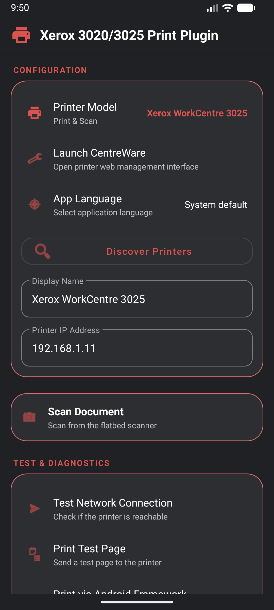
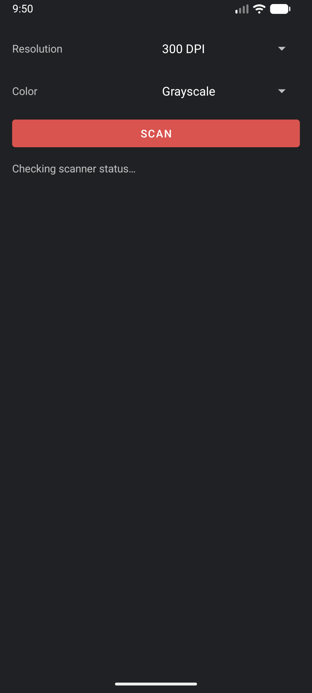
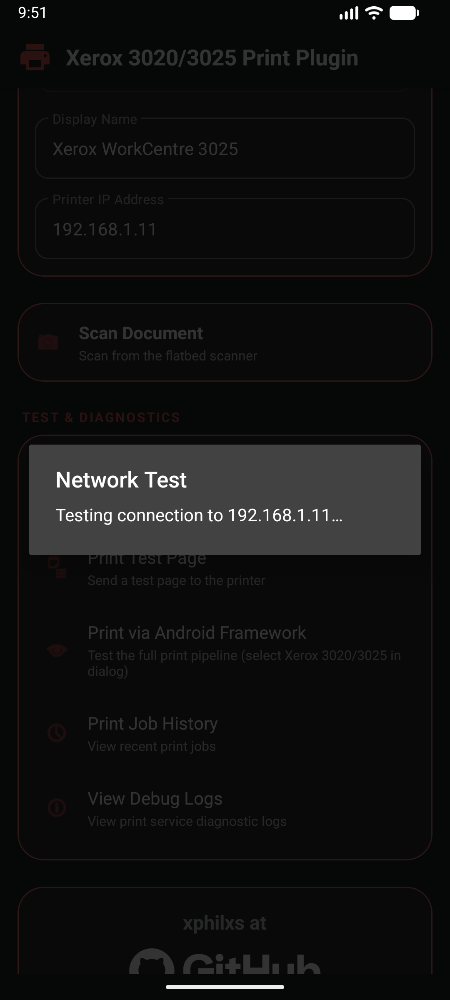

# Xerox 3020/3025 Print & Scan Plugin

> **Disclaimer**: This is an open-source utility designed to provide local printing and scanning compatibility for Xerox Phaser 3020 and WorkCentre 3025 devices on Android. This project is not affiliated with, endorsed by, or sponsored by Xerox Corporation. All trademarks and registered trademarks are the property of their respective owners.

An open-source Android Print Service plugin and scanner companion for Xerox/Samsung AirPrint compatible printers enabling direct local network printing and scanning over Wi-Fi with zero cloud dependencies, zero accounts, and zero telemetry.

---

## Screenshots

  
  &nbsp;&nbsp;
  
  &nbsp;&nbsp;
  

  <em>Settings &nbsp;&nbsp;&nbsp;&nbsp;&nbsp;&nbsp;&nbsp;&nbsp;&nbsp;&nbsp;&nbsp;&nbsp;&nbsp;&nbsp;&nbsp;&nbsp;&nbsp;&nbsp;&nbsp;&nbsp;&nbsp;&nbsp;&nbsp;&nbsp;&nbsp;&nbsp;&nbsp;&nbsp;&nbsp; Scanner &nbsp;&nbsp;&nbsp;&nbsp;&nbsp;&nbsp;&nbsp;&nbsp;&nbsp;&nbsp;&nbsp;&nbsp;&nbsp;&nbsp;&nbsp;&nbsp;&nbsp;&nbsp;&nbsp;&nbsp;&nbsp;&nbsp;&nbsp;&nbsp;&nbsp;&nbsp;&nbsp;&nbsp;&nbsp; Network test</em>

---

## Installation & Setup

### Step 1: Download and Install the APK
1. Download the latest APK from the [Releases page](../../releases/latest).
2. Open the APK file on your Android device (Android 8.0+). When prompted, allow installation from unknown sources.
3. Tap **Install**.

### Step 2: Configure Printer Model & IP
1. Open the **Xerox 3020/3025 Print Plugin** app.
2. Select your printer model (**Xerox Phaser 3020** [Print only] or **Xerox WorkCentre 3025** [Print & Scan]).
3. Enter your printer's local IP address or use **Discover Printers**.
4. Tap **Test Network Connection** to verify connectivity.

### Step 3: Enable the Print Service
1. Go to **Android Settings > Connected devices > Printing**.
2. Tap **Xerox 3020/3025 Print Plugin** and toggle it **ON**.

### Step 4: Print!
Open any document, photo, or web page, tap **Share** or **Print**, and select your printer.

---

## Features

- **Multi-Model Support** — Seamlessly configured for Xerox Phaser 3020 (Print) and WorkCentre 3025 (Print & Scan). More models coming soon!
- **Universal Printing** — Print documents, photos, and web pages from any app supporting Android's print system.
- **Document Scanning** (WorkCentre 3025) — Scan directly from the flatbed scanner to your phone (JPEG, up to 300 DPI, grayscale/color/B&W) via standalone action card.
- **Web Interface Integration** — Launch the printer's web management interface  directly in a built-in full-screen WebView.
- **Dynamic Language Support** — Per-app language switching supporting 20 languages.
- **100% Local & Private** — Communicates strictly over your local Wi-Fi network; no external servers or cloud services are involved.
- **Network Diagnostics** — Verify printer reachability with built-in connectivity checks and test pages.
- **Job History & Logs** — Track print job statuses and view diagnostic debug logs.

## How It Works

### Printing Pipeline
1. Android renders documents to PDF.
2. The plugin renders pages to 600 DPI bitmaps using `PdfRenderer`.
3. Bitmaps are converted to 8-bit grayscale and encoded in URF (Universal Raster Format) with PWG PackBits compression.
4. Data is transmitted via IPP (Internet Printing Protocol) on port 631.

### Scanning Pipeline (WorkCentre 3025)
1. Communicates via WSD (Web Services for Devices) on port 8018 using SOAP/XML.
2. Initiates a scan job based on user resolution and color settings.
3. Retrieves scanned image data via MTOM/MIME response for preview, saving, sharing, or PDF export.

## Compatibility

| | |
|---|---|
| **Supported Models** | Xerox Phaser 3020 (Print only) Xerox WorkCentre 3025 (Print & Scan) |
| **Android Version** | Android 8.0 (Oreo) and above |
| **Paper Sizes** | A4, A5, US Letter |
| **Print Quality** | 600 DPI monochrome raster |
| **Connection** | Local Wi-Fi network |

## Privacy

- Makes no internet connections.
- Contains no analytics, tracking, or telemetry.
- Operates entirely within your local home or office network.
- Open source under the GPLv3 License.

## License

[The GNU General Public License v3.0](LICENSE)
